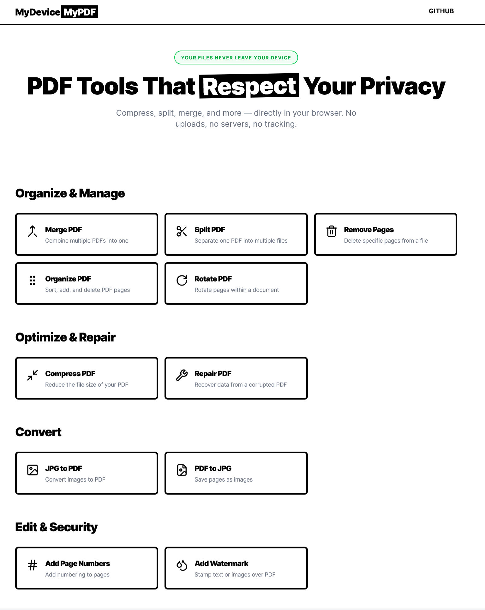

# MyDeviceMyPDF

Privacy-first PDF utilities that run entirely in your browser.
Compress, split, merge, and more — with no uploads, no servers, and no tracking.

## Preview


## Tools

- Merge PDF — combine multiple PDFs into one
- Split PDF — split a PDF into multiple files
- Remove Pages — delete selected pages
- Organize PDF — reorder/add/delete pages
- Rotate PDF — rotate pages within a document
- Compress PDF — lossless (clean/compress) or extreme (rasterize) compression
- Repair PDF — attempt to recover/normalize problematic PDFs
- JPG to PDF — convert images into a PDF
- PDF to JPG — export pages as images
- Add Page Numbers — stamp page numbers
- Add Watermark — stamp text/images over a PDF

## Privacy & security

- All processing happens locally in the browser. Files are never uploaded.
- The app does not require an account and does not include server-side processing.

Note: your browser still loads this web app from wherever it’s hosted. “No uploads” means your PDF files are not sent to a backend for processing.

## Tech stack

- React 19 + React Router
- TypeScript + Vite
- Tailwind CSS
- PDF engines/libraries:
  - `pdf-lib` (merge, page ops, stamping)
  - `pdfjs-dist` (rendering)
  - `mupdf` (WASM-based optimization/compression helpers)
  - `@jspawn/qpdf-wasm` (lossless structural optimization engine)
  - `@jspawn/ghostscript-wasm` (lossless PDF rewrite/compression engine)
- `jszip` (packaging multi-file outputs when needed)

## Requirements

- Node.js (LTS recommended)
- pnpm (recommended, lockfile included) — or npm/yarn if you prefer

## Getting started

Install dependencies:

```bash
pnpm install
```

Run locally:

```bash
pnpm dev
```

Build for production:

```bash
pnpm build
```

Preview the production build:

```bash
pnpm preview
```

Lint:

```bash
pnpm lint
```

## Deployment notes (SPA routing)

This app uses React Router’s `BrowserRouter`. If you deploy to static hosting, configure an SPA fallback so all routes serve `index.html`.

- Netlify: add a redirect rule to `/*  /index.html  200`
- Vercel: configure rewrites to `/index.html`
- Nginx/Apache: route unknown paths to `index.html`

## Assets required at runtime

These files are served from `public/` and must be included in your deploy output:

- `public/pdf.js/pdf.worker.min.mjs` (PDF.js worker)
- `public/mupdf-wasm.wasm` (MuPDF WASM binary)
- `public/qpdf-wasm.wasm` (QPDF WASM binary)
- `public/ghostscript-wasm.wasm` (Ghostscript WASM binary)

## Known limitations

- “Extreme” compression rasterizes pages; text may become unselectable and quality will drop.
- Very large PDFs can be memory-intensive; performance depends on the device/browser.
- Some encrypted/password-protected PDFs may not be supported until an unlock feature is added.

## Contributing

Issues and pull requests are welcome. Please keep changes focused and avoid adding server-side dependencies—this project is intended to stay 100% client-side.

## License

MIT — see [LICENSE](LICENSE).
