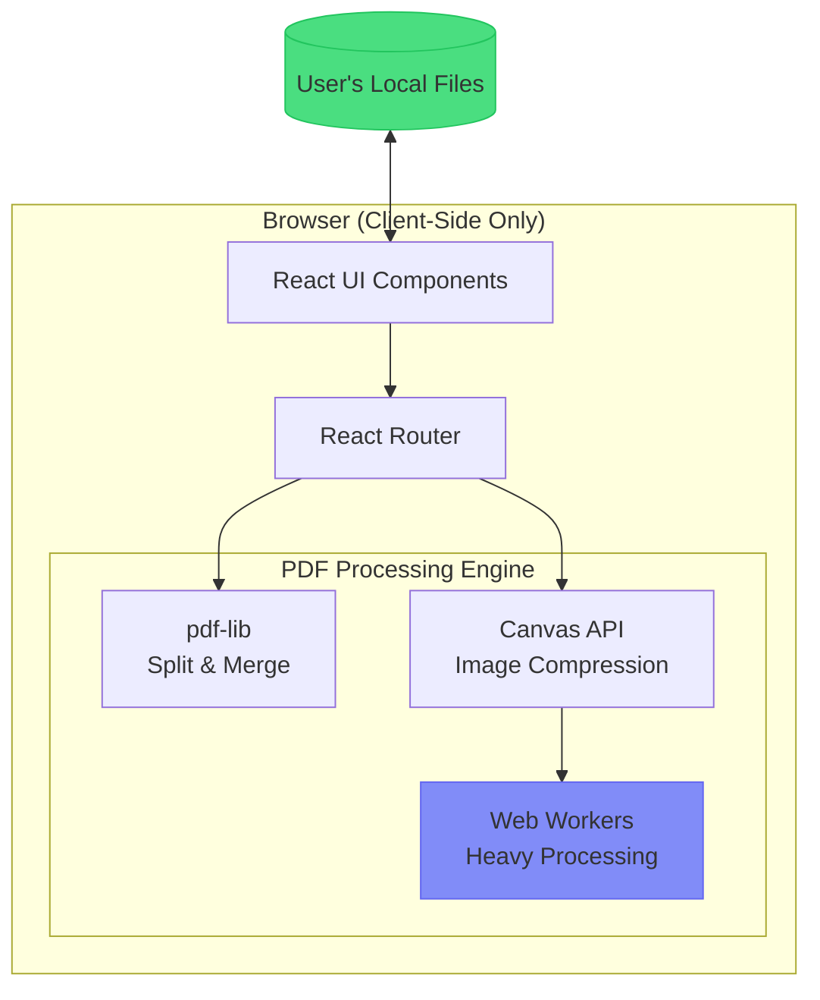

# MyDeviceMyPDF - Browser-Only PDF Tools

A privacy-first React application for PDF compression, splitting, and merging that processes files **entirely in the browser** - your files never leave your device.

## User Review Required

> [!IMPORTANT]
> **Technology Choice**: This plan uses **Vite + React + TypeScript** for fast development. Let me know if you prefer Next.js or another framework.

> [!NOTE]
> **Compression Approach**: Browser-based PDF compression focuses on **image optimization** within PDFs using Canvas API. Text-heavy PDFs may see minimal size reduction since text/vector content is already compact.

---

## Proposed Architecture



---

## Proposed Changes

### 1. Project Setup

#### [NEW] Project Root Files

| File | Purpose |
|------|---------|
| `package.json` | Dependencies: `react`, `react-router-dom`, `pdf-lib` |
| `vite.config.ts` | Vite configuration |
| `tsconfig.json` | TypeScript config |
| `index.html` | Entry HTML |

**Commands:**
```bash
npm create vite@latest ./ -- --template react-ts
npm install pdf-lib react-router-dom
```

---

### 2. Core PDF Utilities

#### [NEW] [pdf-utils.ts](file:///c:/Users/kiran/code/p/pdftools/src/lib/pdf-utils.ts)

Core PDF manipulation functions:

| Function | Description |
|----------|-------------|
| `compressPDF(file)` | Extracts images, compresses via Canvas, rebuilds PDF |
| `splitPDF(file, ranges)` | Splits PDF into multiple files by page ranges |
| `mergePDFs(files)` | Combines multiple PDFs into one |

#### [NEW] [compression.worker.ts](file:///c:/Users/kiran/code/p/pdftools/src/lib/compression.worker.ts)

Web Worker for image compression to prevent UI freezing on large PDFs.

---

### 3. UI Components

#### [NEW] [Layout.tsx](file:///c:/Users/kiran/code/p/pdftools/src/components/Layout.tsx)

Main layout with navigation header and privacy badge.

#### [NEW] [FileDropzone.tsx](file:///c:/Users/kiran/code/p/pdftools/src/components/FileDropzone.tsx)

Drag-and-drop file upload with:
- Visual feedback on drag
- File type validation (PDF only)
- File size display

#### [NEW] [ProgressIndicator.tsx](file:///c:/Users/kiran/code/p/pdftools/src/components/ProgressIndicator.tsx)

Processing progress with percentage and status messages.

---

### 4. Pages

#### [NEW] [HomePage.tsx](file:///c:/Users/kiran/code/p/pdftools/src/pages/HomePage.tsx)

Landing page featuring:
- Hero section with privacy-first messaging
- Three tool cards (Compress, Split, Merge)
- Trust indicators ("100% Browser-Based", "No Upload Required")

#### [NEW] [CompressPage.tsx](file:///c:/Users/kiran/code/p/pdftools/src/pages/CompressPage.tsx)

- File upload
- Compression quality slider (Low/Medium/High)
- Before/after size comparison
- Download button

#### [NEW] [SplitPage.tsx](file:///c:/Users/kiran/code/p/pdftools/src/pages/SplitPage.tsx)

- File upload
- Page range selector (e.g., "1-3, 5, 7-10")
- Visual page preview thumbnails
- Download as ZIP or individual files

#### [NEW] [MergePage.tsx](file:///c:/Users/kiran/code/p/pdftools/src/pages/MergePage.tsx)

- Multi-file upload
- Drag-to-reorder file list
- Merge and download

---

### 5. Styling

#### [NEW] [index.css](file:///c:/Users/kiran/code/p/pdftools/src/index.css)

Modern design system with:
- Dark mode by default with light mode toggle
- Glassmorphism effects
- Gradient accents (purple → cyan)
- Smooth micro-animations

---

## File Structure

```
pdftools/
├── src/
│   ├── components/
│   │   ├── Layout.tsx
│   │   ├── FileDropzone.tsx
│   │   ├── ProgressIndicator.tsx
│   │   └── PrivacyBadge.tsx
│   ├── pages/
│   │   ├── HomePage.tsx
│   │   ├── CompressPage.tsx
│   │   ├── SplitPage.tsx
│   │   └── MergePage.tsx
│   ├── lib/
│   │   ├── pdf-utils.ts
│   │   └── compression.worker.ts
│   ├── App.tsx
│   ├── main.tsx
│   └── index.css
├── public/
├── index.html
├── package.json
├── vite.config.ts
└── tsconfig.json
```

---

## Verification Plan

### Manual Testing

Since this is a new project with file-based operations, manual testing is most appropriate:

| Test | Steps |
|------|-------|
| **Compress** | 1. Run `npm run dev`<br/>2. Navigate to Compress page<br/>3. Upload a PDF with images<br/>4. Verify output file is smaller |
| **Split** | 1. Upload a multi-page PDF<br/>2. Enter range "1-2"<br/>3. Download and verify only pages 1-2 exist |
| **Merge** | 1. Upload 2+ PDFs<br/>2. Reorder them<br/>3. Download merged file and verify page order |
| **Privacy** | 1. Open browser DevTools → Network tab<br/>2. Perform all operations<br/>3. Verify **zero** network requests during processing |

### Browser Compatibility

Test in Chrome, Firefox, and Safari to ensure Web Workers and Canvas API work correctly.

---


**Design preference**: Strong black and white with bold text?

